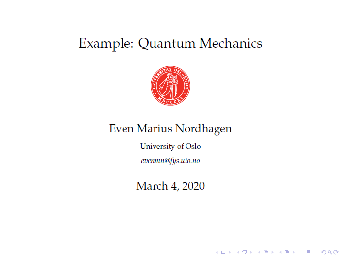
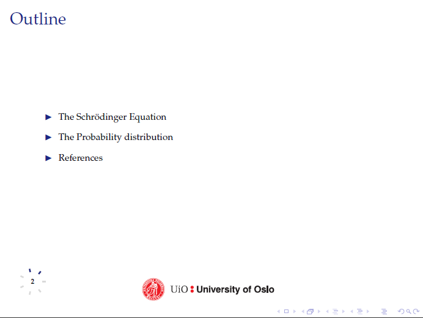

# UiO Beamer Template
----------------------
This is a basic beamer template with a progression wheel and the UiO seal. The progression wheel is updated automatically based on the number of slides, but you may need to compile twice.

## Prerequisites
The package requirements are found in preamble.tex.

## Example slides
The template includes three different frame types: ```\frontframe```, ```\mframe``` and ```\titleframe```.

### ```\frontframe```
The ```\frontframe``` command generates the first slide, containing the title of the presentation, the UiO seal, the author's name and his email. The information should be given before the document starts, ex:

```latex
\newcommand{\mtitle}{Example: Quantum Mechanics}
\newcommand{\mauthor}{Even Marius Nordhagen}
\newcommand{\mmail}{evenmn@fys.uio.no}
\newcommand{\massignn}{.}

\begin{document}

    \frontframe
    
    % More frames here
\end{document}
```

The front slide would then look like 



### ```\mframe```
The ```\mframe{arg1}{arg2}{arg3}``` command is the most flexible one. The first argument gives the title of the slide, the second argument gives the subtitle and the last argument gives the actual contents. An outline slide without subtitle can be made like this:

```latex
\mframe{Outline}{}{
	\begin{itemize}
		\setlength\itemsep{1em}	% This line specifies the spacing between bullet points
		\item The Schrödinger Equation
		\item The Probability distribution
		\item References
	\end{itemize}
}
```
The result is



### ```\titleframe```
The last command is ```\titleframe{arg1}``` (should not be confused with ```\frontframe```). This command generates a plain slide with a large centered text specified by the argument. Example of usage:

```latex
\titleframe{Thank you!}
```

The following slide is generated:


## Presentation mode on Linux
For presentation mode, run 

```pdfpc -n right tex/main.pdf```
